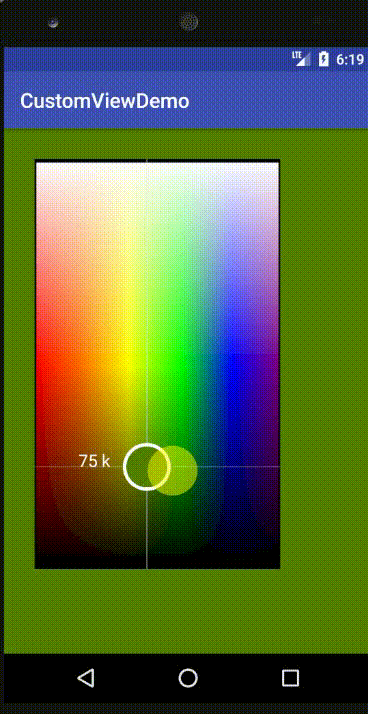

# Android-CustomView-Color-Picker :checkered_flag:
  

#### *Color Picker work With any image and pick Color of the Image Accordingly* :heavy_check_mark:

> Attributes Like :star2:
* Background Image 

`of which of You need to Pick the color.`
* Cusror Image
* Cursor Width
* GuideLine If Required :heavy_plus_sign: , :heavy_minus_sign:
`Guideline is a Horizontal or Vertical line corresponding to the cusor hover.`

* Cursor Color
* Attributes for Ripple Effect 

```xml
android:background="?attr/selectableItemBackgroundBorderless

android:foreground="?attr/selectableItemBackgroundBorderless
```


>UI attribute to add for using the custom-color-picker

```xml
<com.example.kripajha.customviewdemo.Views.CustomView
       android:id="@+id/customView"
       android:layout_width="240dp"
       android:layout_height="400dp"
       android:layout_margin="30dp"
       app:SetHorizantalLine="true"
       app:SetVerticalLine="true"
       android:background="?attr/selectableItemBackgroundBorderless"
       android:foreground="?attr/selectableItemBackgroundBorderless"
       android:clickable="true"
       app:backGround_image="@drawable/colorpickerrectangular"
       app:circle_image="@drawable/cursor"
       app:circle_radius="20dp"
       app:rectangle_breadth="1dp"
       app:rectangle_color="#9ee2dee3" />
```

> **Working Demo of the Above Sample**



`The Above Code is so Designed As one can just Implement the Interface and use the Properties as per the MouseEvent Listener`

@connect me in case of any doubt https://in.linkedin.com/in/kripa-shankar-jha


